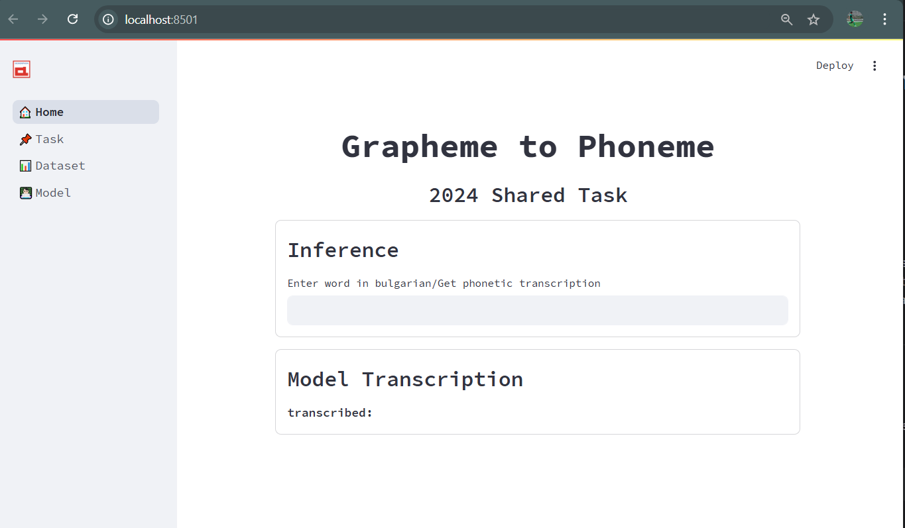
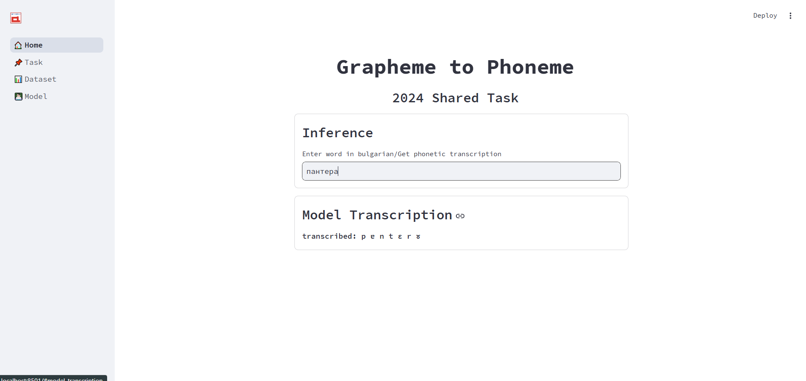
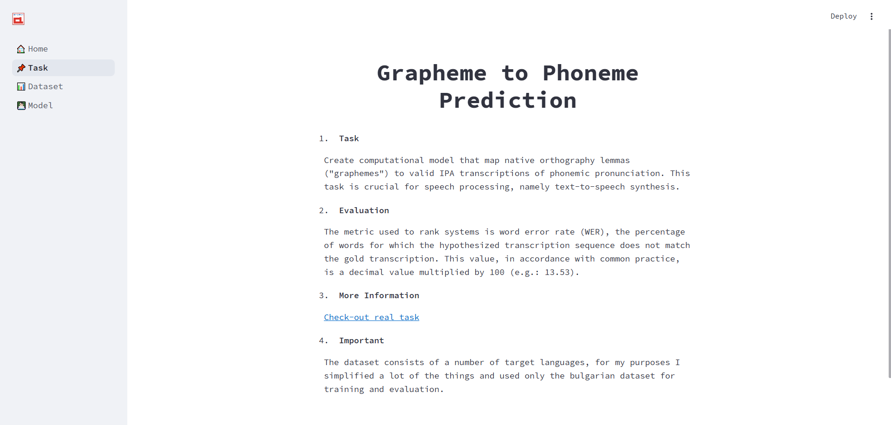
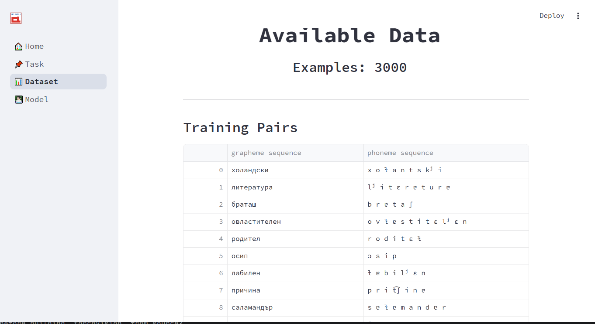
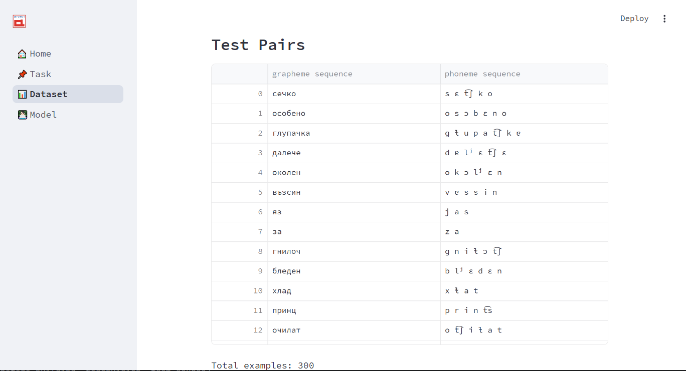
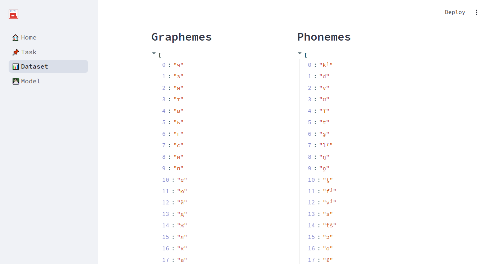
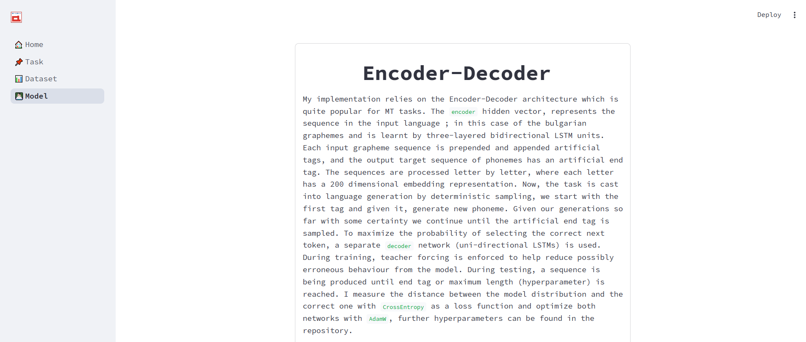

<h1 align="center">Machine-Translation </h1>

<h2 align="center">Part of <i>Grapheme to Phoneme</i> Shared Task </h2>

 
## Setup
In order to run the project locally, you will need to at least install `streamlit`. Clone the project at a folder, open it 
and then type `streamlit run main.py` in the command line. Now, you can explore my work in any modern browser.

---

## Results

Final **WER (Word Error Rate)** score on the test dataset is **10,5**. Best result on the
validation dataset was **22,4** achieved on the 30th epoch. The model had early stopping with 4 evaluation rounds patience. For more information about the implementation
and the hyperparameters check out the simple webpage. 

---
## Workflow

Now, that you have what you need and successfully managed to build and run, you will be able to see this screen:

You can enter a word (only with cyrillic characters) and get its transcription.

Example: 

Translation : **пантера - panther**

In case you want to get to know more about the task, the dataset and my approach you can use
the navigation bar to read more.

for example, the alphabets that will be used as source/target language.

description of my approach:

**NB:** Any comments, suggestions, improvements will be considered, so please let me know.    

## Future directions
- What could lead to better results is freezing the embedding layers of the source network and the target network with pretrained character embeddings. Many papers cite that, for such task initializing the embeddings with pretrained
vectors generally leads to improved results. 
- The **LSTM** units have a relatively complex way of memorizing the important information to allow them to perform better than regular RNN cells over long sequences.
However, implementing attention mechanism is most definitely a better way of getting the relevant information out of the encoder hidden state, at each step of unrolling the output network - `decoder`.